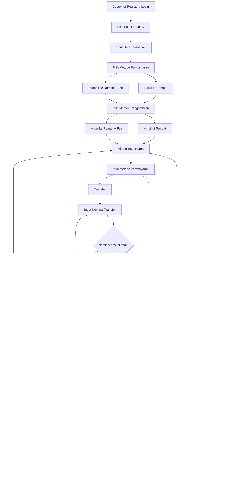

```mermaid
flowchart TD
    A[Customer Register / Login] --> B[Pilih Paket Laundry]
    B --> C[Input Data Tambahan]
    C --> D[Pilih Metode Pengantaran]

    D --> D1[Bawa ke Tempat]
    D --> D2[Diambil ke Rumah + Fee]

    D1 --> E[Pilih Metode Pengambilan]
    D2 --> E

    E --> E1[Ambil di Tempat]
    E --> E2[Antar ke Rumah + Fee]

    E1 --> F[Hitung Total Harga]
    E2 --> F[Hitung Total Harga]

    F --> G[Pilih Metode Pembayaran]

    G --> H[COD]
    G --> I[Transfer]

    H --> J[Buat Transaksi]
    J --> K[Tampilkan Deskripsi Transaksi]

    I --> L[Input Nominal Transfer]
    L --> M{Nominal sesuai total?}

    M -->|Ya| N[Proses Pembayaran]
    N --> O[Status Pembayaran: Paid]
    O --> K

    M -->|Tidak| P[Tampilkan Error Nominal Tidak Sesuai]
    P --> L

    K --> Q[Pesanan Dibuat]

    Q --> R[Staff Melihat Pesanan]
    R --> S[Staff Update Status Pesanan]

    S --> T{Customer tambah service?}

    T -->|Pesanan belum selesai| U[Tambah DetailPesanan]
    U --> F

    T -->|Pesanan sudah success| V[Buat Pesanan Baru sebagai Tambahan]
    V --> F

    T -->|Tidak| W[Pesanan Selesai]

```