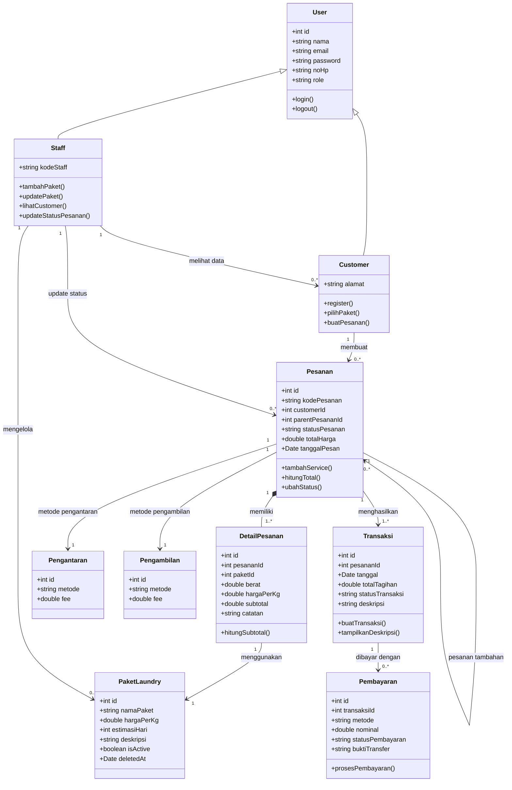

```mermaid
classDiagram
    class User {
        +int id
        +string nama
        +string email
        +string password
        +string noHp
        +string role
        +login()
        +logout()
    }

    class Customer {
        +string alamat
        +register()
        +pilihPaket()
        +buatPesanan()
    }

    class Staff {
        +string kodeStaff
        +tambahPaket()
        +updatePaket()
        +lihatCustomer()
        +updateStatusPesanan()
    }

    class PaketLaundry {
        +int id
        +string namaPaket
        +double hargaPerKg
        +int estimasiHari
        +string deskripsi
        +boolean isActive
        +Date deletedAt
    }

    class Pesanan {
        +int id
        +string kodePesanan
        +int customerId
        +int parentPesananId
        +string statusPesanan
        +double totalHarga
        +Date tanggalPesan
        +tambahService()
        +hitungTotal()
        +ubahStatus()
    }

    class DetailPesanan {
        +int id
        +int pesananId
        +int paketId
        +double berat
        +double hargaPerKg
        +double subtotal
        +string catatan
        +hitungSubtotal()
    }

    class Pengantaran {
        +int id
        +string metode
        +double fee
    }

    class Pengambilan {
        +int id
        +string metode
        +double fee
    }

    class Transaksi {
        +int id
        +int pesananId
        +Date tanggal
        +double totalTagihan
        +string statusTransaksi
        +string deskripsi
        +buatTransaksi()
        +tampilkanDeskripsi()
    }

    class Pembayaran {
        +int id
        +int transaksiId
        +string metode
        +double nominal
        +string statusPembayaran
        +string buktiTransfer
        +prosesPembayaran()
    }

    User <|-- Customer
    User <|-- Staff

    Customer "1" --> "0..*" Pesanan : membuat

    Pesanan "1" *-- "1..*" DetailPesanan : memiliki
    DetailPesanan "1" --> "1" PaketLaundry : menggunakan

    Pesanan "1" --> "1" Pengantaran : metode pengantaran
    Pesanan "1" --> "1" Pengambilan : metode pengambilan

    Pesanan "1" --> "1..*" Transaksi : menghasilkan
    Transaksi "1" --> "0..*" Pembayaran : dibayar dengan

    Pesanan "0..1" --> "0..*" Pesanan : pesanan tambahan

    Staff "1" --> "0..*" PaketLaundry : mengelola
    Staff "1" --> "0..*" Pesanan : update status
    Staff "1" --> "0..*" Customer : melihat data
```